```mermaid
flowchart TB
    subgraph Système["🖥️ Système MyLife"]
        direction TB

        subgraph Auth["🔐 Authentification"]
            UC1["Se connecter via Google"]
            UC2["Configurer le profil (genre, avatar, nom, âge)"]
            UC3["Personnaliser les conseils émotionnels"]
        end

        subgraph Dashboard["📊 Tableau de Bord"]
            UC4["Visualiser le calendrier Google"]
            UC5["Consulter la météo (Tunisie)"]
            UC6["Voir la progression des tâches"]
            UC7["Recevoir des conseils émotionnels"]
        end

        subgraph Calendar["📅 Calendrier"]
            UC8["Créer un événement"]
            UC9["Modifier un événement"]
            UC10["Supprimer un événement"]
        end

        subgraph Tasks["📋 Gestion des Tâches"]
            UC11["Créer une tâche"]
            UC12["Modifier le statut d'une tâche"]
            UC13["Supprimer une tâche"]
            UC14["Filtrer les tâches par catégorie"]
            UC15["Gérer les tâches de ménage"]
        end

        subgraph Finance["💰 Gestion Financière"]
            UC16["Ajouter un revenu"]
            UC17["Supprimer un revenu"]
            UC18["Ajouter une dépense"]
            UC19["Supprimer une dépense"]
            UC20["Ajouter une dette"]
            UC21["Mettre à jour une dette"]
            UC22["Supprimer une dette"]
            UC23["Ajouter à la liste de souhaits"]
            UC24["Marquer un souhait comme acheté"]
            UC25["Supprimer un souhait"]
            UC26["Consulter les statistiques financières"]
        end

        subgraph Muslim["🕌 Hub Musulman"]
            UC27["Consulter les horaires de prière"]
            UC28["Lire le Coran (liste des sourates)"]
            UC29["Lire une sourate (arabe + traduction)"]
            UC30["Consulter les Adhkar (Dhikr)"]
            UC31["Parcourir les catégories de Dhikr"]
        end

        subgraph Career["💼 Carrière & Stages"]
            UC32["Ajouter une candidature de stage"]
            UC33["Modifier une candidature"]
            UC34["Supprimer une candidature"]
            UC35["Rechercher une entreprise (Clearbit)"]
            UC36["Analyser un CV (PDF.co)"]
            UC37["Voir le parcours de carrière suggéré"]
        end

        subgraph Study["📚 Gestion des Études"]
            UC38["Ajouter un cours"]
            UC39["Supprimer un cours"]
            UC40["Ajouter un devoir"]
            UC41["Marquer un devoir comme fait"]
            UC42["Recevoir des rappels de devoirs"]
        end

        subgraph Hobbies["🎯 Loisirs"]
            UC43["Ajouter un hobby/passion"]
            UC44["Activer/Pause un hobby"]
            UC45["Supprimer un hobby"]
        end

        subgraph Emotions["😊 Émotions"]
            UC46["Analyser son émotion"]
            UC47["Recevoir des conseils personnalisés"]
        end
    end

    %% Acteurs
    User(["👤 Utilisateur"])
    Google(["🔗 Google"])
    WeatherAPI(["🌤️ WeatherAPI"])
    Aladhan(["🕌 API Aladhan"])
    Alquran(["📖 API Alquran.cloud"])
    Clearbit(["🏢 API Clearbit"])
    PDFco(["📄 API PDF.co"])

    %% Relations Utilisateur -> Use Cases
    User --> UC1
    User --> UC2
    User --> UC3
    User --> UC4
    User --> UC5
    User --> UC6
    User --> UC7
    User --> UC8
    User --> UC9
    User --> UC10
    User --> UC11
    User --> UC12
    User --> UC13
    User --> UC14
    User --> UC15
    User --> UC16
    User --> UC17
    User --> UC18
    User --> UC19
    User --> UC20
    User --> UC21
    User --> UC22
    User --> UC23
    User --> UC24
    User --> UC25
    User --> UC26
    User --> UC27
    User --> UC28
    User --> UC29
    User --> UC30
    User --> UC31
    User --> UC32
    User --> UC33
    User --> UC34
    User --> UC35
    User --> UC36
    User --> UC37
    User --> UC38
    User --> UC39
    User --> UC40
    User --> UC41
    User --> UC42
    User --> UC43
    User --> UC44
    User --> UC45
    User --> UC46
    User --> UC47

    %% Relations Système -> Acteurs externes
    UC1 -.->|"OAuth 2.0"| Google
    UC4 -.->|"API Calendar"| Google
    UC8 -.->|"API Calendar"| Google
    UC9 -.->|"API Calendar"| Google
    UC10 -.->|"API Calendar"| Google
    UC5 -.->|"API météo"| WeatherAPI
    UC27 -.->|"API prières"| Aladhan
    UC28 -.->|"API Coran"| Alquran
    UC29 -.->|"API Coran"| Alquran
    UC35 -.->|"API entreprise"| Clearbit
    UC36 -.->|"API PDF"| PDFco

    %% Styles
    style Système fill:#f0f4ff,stroke:#4a6cf7,stroke-width:3px
    style Auth fill:#fff0f0,stroke:#ff6b6b,stroke-width:2px
    style Dashboard fill:#f0fff4,stroke:#51cf66,stroke-width:2px
    style Calendar fill:#fff9e6,stroke:#fcc419,stroke-width:2px
    style Tasks fill:#e7f5ff,stroke:#339af0,stroke-width:2px
    style Finance fill:#fff0f6,stroke:#f06595,stroke-width:2px
    style Muslim fill:#e6fcf5,stroke:#20c997,stroke-width:2px
    style Career fill:#f3f0ff,stroke:#845ef7,stroke-width:2px
    style Study fill:#fff4e6,stroke:#ff922b,stroke-width:2px
    style Hobbies fill:#e3fafc,stroke:#22b8cf,stroke-width:2px
    style Emotions fill:#fff5f5,stroke:#ff8787,stroke-width:2px
    style User fill:#e8e8e8,stroke:#333,stroke-width:2px
    style Google fill:#fce8e6,stroke:#ea4335,stroke-width:2px
    style WeatherAPI fill:#e8f4fd,stroke:#1a73e8,stroke-width:2px
    style Aladhan fill:#e6f5e6,stroke:#34a853,stroke-width:2px
    style Alquran fill:#fff8e1,stroke:#f9a825,stroke-width:2px
    style Clearbit fill:#f3e5f5,stroke:#8e24aa,stroke-width:2px
    style PDFco fill:#ffebee,stroke:#c62828,stroke-width:2px
```

# Diagramme de Cas d'Utilisation Général — MyLife

> Ce diagramme présente l'ensemble des fonctionnalités du projet **MyLife** (application Laravel de gestion de vie personnelle).
> 
> 💡 **Pour visualiser** : installez l'extension **Markdown Preview Mermaid Support** dans VSCode, ou copiez le code dans [Mermaid Live Editor](https://mermaid.live/).

---

---

## 📋 Tableau récapitulatif des cas d'utilisation

| Module | Cas d'utilisation | Description |
|--------|-------------------|-------------|
| **Authentification** | Se connecter via Google | OAuth 2.0 avec Google |
| | Configurer le profil | Nom, âge, genre, avatar |
| | Personnaliser conseils émotionnels | 5 conseils par émotion |
| **Tableau de Bord** | Visualiser calendrier | Événements Google Calendar |
| | Consulter météo | Tunisie fixe via WeatherAPI |
| | Voir progression tâches | Stats par catégorie |
| | Recevoir conseils émotionnels | Basé sur l'humeur |
| **Calendrier** | CRUD événements | Créer, modifier, supprimer |
| **Tâches** | CRUD tâches | Avec catégories et priorités |
| | Gérer tâches de ménage | Toggle statut spécifique |
| **Finances** | Gérer revenus/dépenses | Ajout/suppression |
| | Gérer dettes | Suivi avec statut |
| | Gérer liste de souhaits | Priorités et achats |
| | Statistiques | Mensuelles et journalières |
| **Hub Musulman** | Horaires prière | API Aladhan (Tunisie) |
| | Coran | Liste + lecture sourates |
| | Dhikr | Catégories et adhkar |
| **Carrière** | Suivi stages | CRUD candidatures |
| | Recherche entreprise | API Clearbit |
| | Analyse CV | Extraction skills via PDF.co |
| **Études** | Cours et devoirs | CRUD + rappels |
| **Loisirs** | Gestion hobbies | Niveau, fréquence, statut |
| **Émotions** | Analyse émotion | Placeholder pour IA |
| | Conseils personnalisés | Basé sur le profil |

---

## 🎨 Fichier source PlantUML

Voir [`use-case-diagram.puml`](./use-case-diagram.puml) pour la version PlantUML (utilisable avec l'extension PlantUML sur VSCode).

